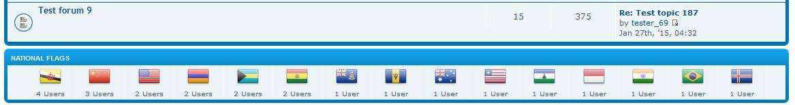
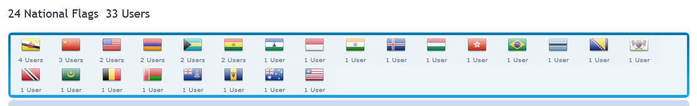
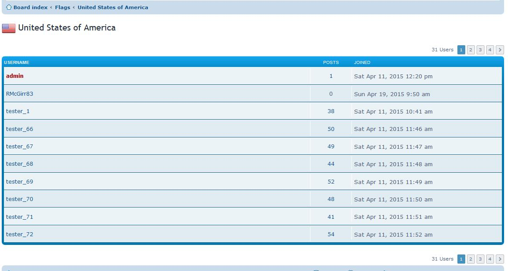

phpBB-nationalflags
=========================

phpBB extension which allows users to be able to choose a national flag and have a top (those with the most users selecting the flag) number of flags display on the index page of a phpBB forum.  Header is link to a listing of all users of a flag.  Clicking on user count of the flag displays the users that have that flag set.

Index Page


Custom Flag Page


Users of a Flag


[](https://travis-ci.org/rmcgirr83/phpBB-nationalflags)
## Installation

### 1. clone
Clone (or download and move) the repository into the folder ext/rmcgirr83/nationalflags:

```
cd phpBB3
git clone https://github.com/rmcgirr83/phpBB-nationalflags.git ext/rmcgirr83/nationalflags/
```

### 2. activate
Go to admin panel -> tab customise -> Manage extensions -> enable National Flags

Within the Admin panel visit the Extensions tab and choose the settings (allow, require on registration, display message) for the extension.

## Update instructions:
1. Go to your phpBB Board > Admin Control Panel > Customise > Manage extensions > National Flags: disable
2. Delete all files of the extension from ext/rmcgirr83/nationalflags EXCEPT for the flags directory
3. Upload all the new files to the same locations
4. Go to your phpBB Board > Admin Control Panel > Customise > Manage extensions > National Flags: enable
